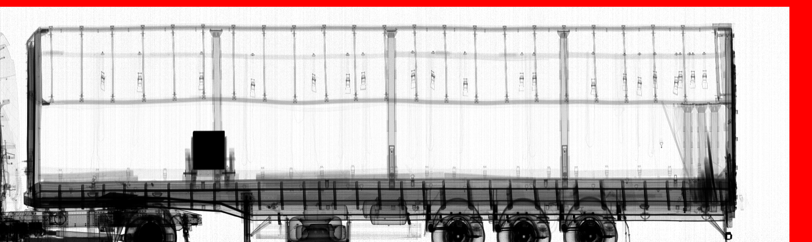
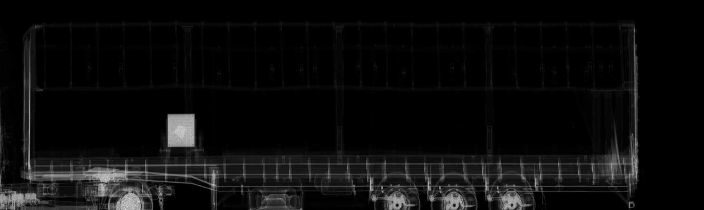

### README: Automated X-Ray Image Processing

This repository contains the C++ code for processing and calibrating raw data from an inspection system that uses a betatron as an X-ray source. The project focuses on converting raw measurement data into a human-readable image format (BMP) for further analysis. This codebase is part of a larger research project on automated processing of X-ray images for cargo analysis.

---

### Project Context

[cite_start]This work was performed as a bachelor's thesis at Peter the Great St. Petersburg Polytechnic University's Higher School of Fundamental Physical Research in 2023[cite: 1, 23]. [cite_start]The research was conducted in collaboration with the company **"Indicom"**[cite: 70]. [cite_start]The primary goal was to study and apply various image clustering methods to X-ray images obtained from an inspection system to improve image quality and simplify analysis[cite: 79, 134].

[cite_start]The inspection system uses a **betatron** as an X-ray source, which accelerates electrons to generate hard X-rays[cite: 12, 262, 264]. [cite_start]A key feature of this system is that the driver remains inside the vehicle during the scan, which significantly speeds up the inspection process[cite: 284, 285]. [cite_start]However, this design choice leads to a low radiation dose and, consequently, a significant level of statistical noise in the resulting X-ray images[cite: 138, 286].

[cite_start]To address this noise and improve image quality, the project explored several **clustering algorithms**, including k-means, c-means, mean-shift, and the Leader algorithm[cite: 421]. [cite_start]The code provided here is the foundational part of the project, responsible for generating the initial normalized and thickness-represented images from the raw data before these clustering algorithms are applied[cite: 416].

---

### Code Summary

The C++ program in `main.cpp` performs the following key functions:

1.  **Data Reading**: The program reads raw data from a binary file (`block.int`) that contains the X-ray intensity measurements. [cite_start]The file format includes the image dimensions (width and height) and a header before the pixel data[cite: 291].
2.  [cite_start]**Data Processing and Calibration**: The core of the program is the `process_data` function, which performs two main calibration steps to correct for image distortions caused by the betatron's characteristics[cite: 292, 293]:
    * **Background Normalization**: It first subtracts a signal threshold to normalize the background.
    * [cite_start]**Betatron and Detector Calibration**: It then calibrates the image by correcting for the varying intensity of the betatron's impulses and its narrow beam[cite: 292, 293]. [cite_start]This is done using reference rows and columns of detectors that are not occluded by the scanned object[cite: 294].
3.  **Image Generation**: The calibrated data is used to generate a normalized bitmap image (`normalized_image.bmp`). [cite_start]The program also has an option to generate a second image (`thickness_image.bmp`) which represents the **mass thickness** of the scanned objects[cite: 317, 319]. [cite_start]This representation is based on the law of X-ray attenuation, where the logarithm of the intensity ratio is proportional to the mass thickness[cite: 308].
4.  **BMP File Handling**: The code includes helper functions to create the necessary file and info headers for the BMP format and to write the image data to a file.

### Visual Results

Here are the images generated by the `main.cpp` program:

#### Normalized Image

This image shows the raw data after background normalization and calibration, providing a clear visual of the scanned cargo.

#### Mass Thickness Image

This image represents the mass thickness of the objects, calculated using the X-ray attenuation law. Darker areas correspond to thicker or denser materials.

***Note: This repository only includes the code for initial image processing and does not contain the code for the clustering algorithms themselves.***
